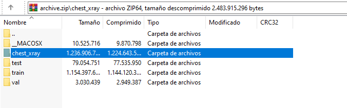
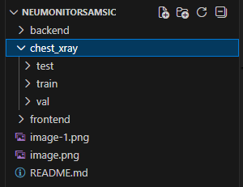
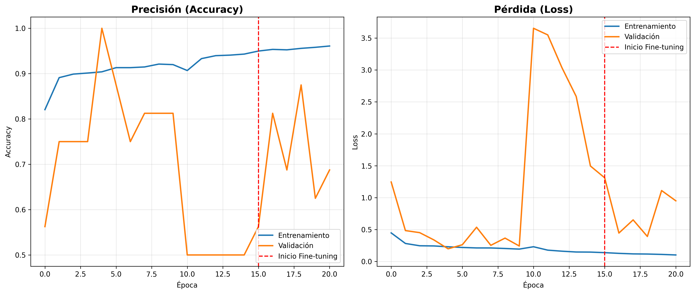
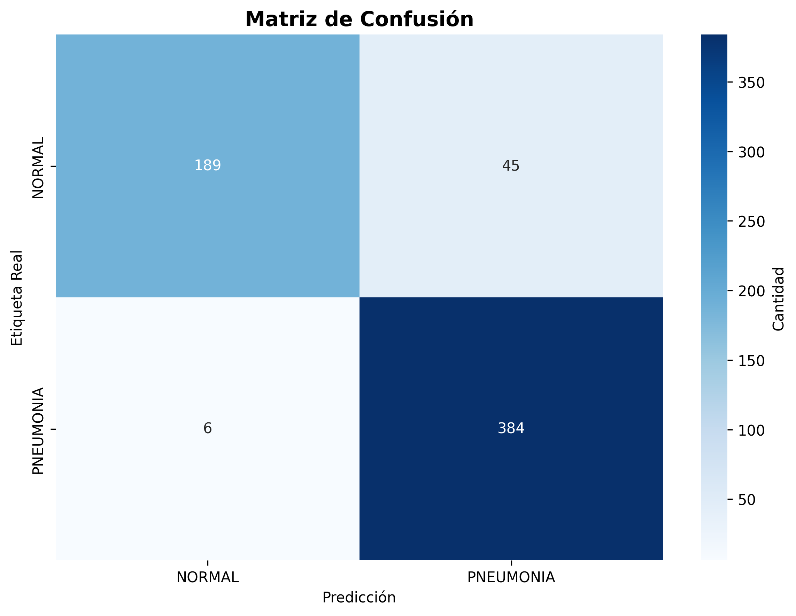

# Neumonitor -- Sistema Web de Detección Automática de Neumonía mediante IA
Equipo NeumoScanners - Samsung Innovation Campus

## Integrantes del equipo y roles

  --------
  Nombre                                                       Rol
  ------------------------------------------------------------ -------------------
  **John Villacís Ramón**                                      Specialist en
                                                               dataset &
                                                               preprocesamiento.
                                                               Encargado de
                                                               recopilar, depurar
                                                               y estandarizar el
                                                               dataset de
                                                               radiografías,
                                                               además de generar
                                                               imágenes
                                                               aumentadas.

  **Joshua Vallejo Luna**                                      Machine Learning
                                                               Engineer. Entrena,
                                                               evalúa y optimiza
                                                               el modelo CNN
                                                               encargado de la
                                                               detección de
                                                               neumonía. Supervisa
                                                               métricas e
                                                               hiperparámetros.

  **Juan Larrea Martínez**                                     Backend & API
                                                               Developer.
                                                               Implementa la API
                                                               de predicción
                                                               (Flask/FastAPI),
                                                               manejo de imágenes
                                                               y comunicación
                                                               entre modelo y
                                                               frontend.

  **Joshúa Castillo Merejildo**                                Frontend Developer.
                                                               Diseña e implementa
                                                               la interfaz web, la
                                                               experiencia del
                                                               usuario y la
                                                               visualización de
                                                               resultados.

  **Brithany Suárez Palacios**                                 Documentation &
                                                               Communication
                                                               Analyst.
                                                               Responsable de la
                                                               documentación
                                                               técnica, redacción
                                                               y presentación del
                                                               proyecto.
  --------


## Nombre del sistema

**Neumonitor -- Sistema web de detección automática de neumonía mediante
inteligencia artificial**


## Descripción del sistema

### Prototipo

Un sistema web capaz de recibir imágenes de radiografías de tórax y
procesarlas mediante un modelo basado en redes neuronales
convolucionales (CNN). El modelo clasifica la imagen como:

-   **Normal**, o\
-   **Neumonía**,

acompañado de una probabilidad asociada.

### Propósito del prototipo

El sistema busca apoyar el proceso de evaluación médica inicial en
centros donde:

-   existe escasez de especialistas,
-   hay carga laboral elevada,
-   o los patrones radiológicos son difíciles de interpretar.

La neumonía es una de las principales causas de hospitalización y
mortalidad, especialmente en niños y adultos mayores. Una herramienta de
apoyo basada en IA puede:

-   acelerar la priorización de casos,
-   mejorar la eficiencia del diagnóstico,
-   y reducir errores derivados del cansancio o exceso de trabajo.

### Funcionamiento general

La plataforma web permite cargar una radiografía. El sistema procesa la
imagen y devuelve:

-   la clasificación (**Normal** / **Neumonía**),
-   la probabilidad,
-   y una visualización sencilla que acompañe el diagnóstico preliminar.

Esta herramienta sirve como apoyo, no como reemplazo del criterio
médico.
### Links de la plataforma web desplegada
Vercel (frontend): https://neumonitor2.vercel.app/  
Render (Backend): https://neumonitor2.onrender.com/ 
Nota: Al estar en plan gratuito de render, demora un poco en encenderse nuevamente cuando hay tiempo de inactividad, sea paciente por favor.

## Cómo usar este proyecto en tu computadora local

Para ejecutar este proyecto en tu entorno local con **Visual Studio Code**, clona este repositorio y sigue estos pasos:

---

## 1. Variables de entorno

### Backend (`backend/.env`):

```env
FRONTEND_URL=http://localhost:3000
BACKEND_URL=http://localhost:8000
PORT=8000
SUPABASE_URL="tu_clave_aqui"
SUPABASE_ANON_KEY="tu_clave_aqui"
SUPABASE_SERVICE_ROLE_KEY="tu_clave_aqui"
NODE_ENV=development

```
### Frontend (`frontend/.env.local`):

```env.local
NEXT_PUBLIC_API_URL=http://localhost:8000
NEXTAUTH_URL=http://localhost:3000
NEXTAUTH_SECRET="tu_clave_aqui"
```
### 2. Backend

Instalar dependencias:
``` bash
cd backend
pip install fastapi uvicorn tensorflow pillow python-multipart python-dotenv supabase email-validator gdown numpy
```
Iniciar el backend:
``` bash
uvicorn app:app --host 0.0.0.0 --port 8000 --reload
``` 
Nota: Para evitar errores con importaciones relativas en controladores y middleware, ejecutar desde la raíz del proyecto usando backend.app:app como se muestra arriba.

### 2. Ejecutar el modelo (solo si es necesario entrenar o generar el archivo del modelo)

``` bash
cd backend
python model.py
```


### 3. Descargar el archivo dataset del Kaggle 
https://www.kaggle.com/code/madz2000/pneumonia-detection-using-cnn-92-6-accuracy 
Usted tendrá que descomprimir la carpeta chest_array ya que ahí están las tres carpetas necesarias para este proyecto

Se recomienda la siguiente estructura de proyecto en su visual studio code:



### 4. Frontend

Instalar dependencias:

cd frontend
``` bash
npm init -y
npm install --save-dev @types/node @types/react @types/react-dom @types/next
npm install react react-dom next @mui/material @mui/icons-material @emotion/react @emotion/styled zustand axios react-hook-form next-auth
npm install
```
Iniciar el frontend:
``` bash
npm run dev
```

# Modelo de Detección de Neumonía con MobileNetV2

Este módulo implementa y entrena un modelo de **Deep Learning** para la **clasificación automática de radiografías de tórax** en dos clases:

* **NORMAL**
* **PNEUMONIA**

El modelo está diseñado como **sistema de apoyo a la decisión médica**, no como reemplazo del diagnóstico clínico.

---

##  ¿Qué hace `model.py`?

El archivo `model.py`, que está en la carpeta de backend, realiza todo el flujo de entrenamiento y evaluación del modelo:

### 1. Preparación de datos

* Carga imágenes desde los directorios:

  * `train/` (entrenamiento)
  * `val/` (validación)
  * `test/` (evaluación final)
* Redimensiona las imágenes a **224×224**
* Aplica **data augmentation** para mejorar la generalización:

  * Rotaciones
  * Zoom
  * Volteos horizontales

---

### 2. Arquitectura del modelo

Se utiliza **Transfer Learning** con **MobileNetV2**, una arquitectura optimizada y eficiente.

**Estructura:**

* MobileNetV2 preentrenada (congelada inicialmente)
* Global Average Pooling
* Capas densas personalizadas:

  * Dense (256) + BatchNorm + Dropout
  * Dense (128) + BatchNorm + Dropout
* Capa de salida con **2 neuronas (softmax)**

**Parámetros:**

* Total: **2.62M**
* Entrenables: **~362K**
* No entrenables: **~2.25M**

Esto reduce el sobreajuste y acelera el entrenamiento.

---

##  Fases de entrenamiento

###  Fase 1 – Entrenamiento con base congelada

* MobileNetV2 congelada
* Solo se entrenan las capas finales
* Objetivo: aprender patrones generales sin dañar pesos preentrenados

✔️ Mejor época: **Época 5**
✔️ `val_accuracy = 100%` (validación muy pequeña)

---

###  Fase 2 – Fine-tuning

* Se descongelan las **últimas capas** de MobileNetV2
* Learning rate más bajo (`1e-4`)
* Permite ajustar características más específicas de radiografías

✔️ Mejor época: **Época 18**
✔️ `val_accuracy = 87.5%`

---

##  Interpretación de las gráficas

###  Precisión (Accuracy)


* **Entrenamiento:** aumenta de forma estable hasta ~96%
* **Validación:** presenta fluctuaciones fuertes

 **Interpretación**:

* La validación es pequeña (solo 16 imágenes), por eso:

  * Cambios grandes entre épocas
  * No representa error del modelo
* La tendencia general es positiva

---

###  Pérdida (Loss)

* **Training loss:** disminuye progresivamente → aprendizaje correcto
* **Validation loss:** picos altos en algunas épocas

 **Interpretación**:

* Los picos indican imágenes difíciles o ambiguas
* No invalida el modelo, es esperado con datasets pequeños

---

##  Matriz de Confusión



| Real \ Predicción | NORMAL | PNEUMONIA |
| ----------------- | ------ | --------- |
| **NORMAL**        | 189    | 45        |
| **PNEUMONIA**     | 6      | 384       |

### 🔍 Interpretación clínica:

* **Verdaderos positivos (PNEUMONIA bien detectada):** 384
* **Falsos negativos (PNEUMONIA → NORMAL):** 6  *(muy bajo)*
* **Alta sensibilidad para neumonía**, lo cual es clave en medicina

 El modelo **prioriza detectar neumonía**, incluso si eso implica algunos falsos positivos.

---

##  Evaluación final en Test Set

* **Accuracy:** **91.83%**
* **Loss:** **0.2402**
* Total de imágenes evaluadas: **624**

###  Reporte de clasificación

| Clase     | Precision | Recall | F1-score |
| --------- | --------- | ------ | -------- |
| NORMAL    | 0.97      | 0.81   | 0.88     |
| PNEUMONIA | 0.90      | 0.98   | 0.94     |

 **Interpretación**:

* Recall de **98% en neumonía** → casi todos los casos reales se detectan
* Muy buen balance entre precisión y sensibilidad

---

##  Análisis del nivel de confianza

El modelo también analiza la **confianza (probabilidad softmax)** de sus predicciones:

* **Confianza promedio:** 93.55%
* **Confianza mínima:** 50.91%
* **Confianza máxima:** 99.99%
* **Predicciones >90% confianza:** 81.41%
* **Predicciones >95% confianza:** 69.55%

###  Importante sobre la confianza

> Un nivel de confianza menor al 80% **NO significa diagnóstico incorrecto**.

La confianza indica:

* Qué tan clara fue la diferencia entre clases
* Ambigüedad visual en la imagen
* Patrones sutiles o mixtos

El modelo puede **acertar correctamente con 60–75%**, especialmente en imágenes difíciles.

---

##  Conclusión

El modelo:

* Aprende correctamente
* Generaliza bien en test
* Detecta neumonía con **alta sensibilidad**
* Presenta métricas acordes a modelos clínicos de apoyo

**Uso recomendado**:

* Sistema de apoyo al diagnóstico
* Priorización de atención médica
* Evaluación preliminar automatizada

**No reemplaza al médico**, pero es una herramienta confiable para detección temprana.
